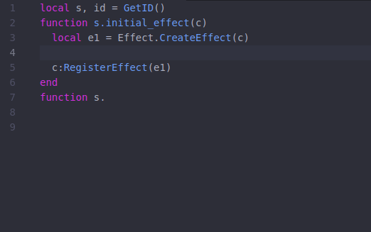

# YGOPro API Autocomplete package for Atom

This is an autocomplete package for Atom that covers the YGOPro Core API.

Currently, this package uses data from this [Chinese translation](https://github.com/247321453/DataEditorX/tree/master/DataEditorX/data) of the API, but it's now outdated and not compatible with the bleeding-edge fork of the YGOPro client, [EDOPro](https://github.com/edo9300/edopro/).

In the near future, this package should be up to date and targeted only for EDOPro.

## Features

- [x] Autocompletes constants, class names and methods.
- [x] Autocompletes card callbacks (condition, cost, target, operation, etc).
- [x] Provides description for each constant, method, callback, etc.
- [x] Adapts method calls for `.` and `:`.
- [x] Infers type from method return types, callback signatures and identifier name.

